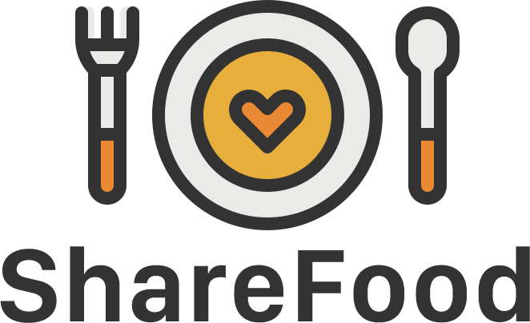

# Hack the Planet Team! 

Share Food es una aplicación en la cual podrás donar los alimentos que tengas en casa y que no vas a consumir, para que así las personas que más los necesitan pueda tener acceso a ellos y así aportar un granito de arena en tan dificil situación que atraviesa el mundo entero y que para algunas familias de pocos recursos ha sido un golpe muy duro en su economía.

# Objetivo del Usuario 🙋🏼

Share Food tiene 2 tipos de usuario:

- El primero de ellos es el usuario que realiza las donaciones, su objetivo principal es entrar a la aplicación y poder postear su donación indicando que tipo de alimento es el qué está donando, cantidad, fecha de expiración, su nombre y número de contacto para ser localizado.

- Nuestro segundo tipo de usuarios es el que recibe los alimentos, bien sea persona natural o alguna institución benéfica, el cual podrá ingresar a nuesta app y verificar cuales son los alimentos que se encuentran disponibles para ser retirados y junto con esta información podrá visualizar nombre de la persona que realiza la donación, número de contacto, tipo de alimento, cantidad y fecha de expiración.

# Tecnologías Utilizadas

- React Js
- React Hooks
- React Redux
- Material Ui
- Firebase/Firestore

